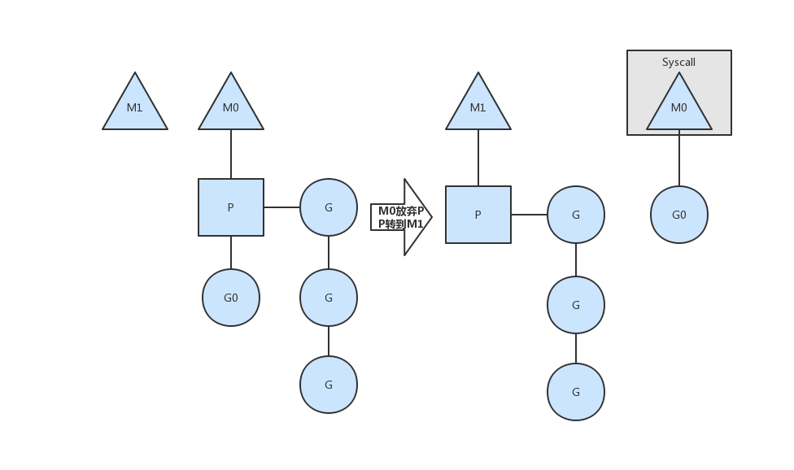

golang最大的特色就是随处可见的goroutine，一个`go`关键字就可以实现原生的并发，main函数本身也是一个gouroutine。无需关心其实现，就可以轻松实现一个高并发的程序。但是，如果能够理解goroutine的调度，对于写出高质量的程序帮助很大。

<!-- more -->

## 线程调度模型

通常用三种线程调度模型，用户级，内核级和两级

### 用户级线程模型
用户线程与内核线程是多对1（N:1) 的映射，优点：调度是在用户程序层面实现的，调度开销非常轻量，缺点：用户线程被阻塞会导致进程内所有线程都被堵塞，因此无法实现真正的并发

### 内核级线程模型
用户线程与内核线程是一对一（1：1）的映射，优点：是借助操作系统内核调度，实现线程创建、切换、销毁，从而实现真正的并发，缺点：由于内核线程调度开销大，性能损耗很大

### 两级线程模型
用户线程与内核线程是多对多 (M:N) 的映射，这种混合型的线程模型集合前面两种线程模型的优势，既能减少调度开发，也能实现真正的并发

## golang GMP模型

golang `GMP`模型在两级线程模型`GM`的基础上加入了中间层`P`

### G
`G, Goroutine`，这个就是通过`go`关键字创建出来`goroutine`，相对于内核线程`2M`的固定栈内存，`goroutine`采取动态扩容的方式，初始分配`2KB`内存，随着任务的运行64系统最大`1GB`。


### M
`M，Machine`, 对应系统线程，代表着真正执行计算的资源，在绑定有效的 `P`后，进入 schedule 循环

### P
`P, Process`, 表示逻辑处理器， 对 G 来说，P 相当于 CPU 核，G 只有绑定到 P(在 P 的 local runq 中)才能被调度。对 M 来说，P 提供了相关的执行环境(Context)，如内存分配状态(mcache)，任务队列(G)等，P 的数量决定了系统内最大可并行的 G 的数量（前提：物理 CPU 核数 >= P 的数量），P 的数量由用户设置的 GOMAXPROCS 决定，但是不论 GOMAXPROCS 设置为多大，P 的数量最大为 256。

## GMP调度
### 正常运行
所有的goroutine运行在同一个M系统线程中，每一个M系统线程维护一个Processor，任何时刻，一个Processor中只有一个goroutine，其他goroutine在runqueue中等待。一个goroutine运行完自己的时间片后，让出上下文，回到runqueue中。 多核处理器的场景下，为了运行goroutines，每个M系统线程会持有一个Processor。

### 线程堵塞
当正在运行的goroutine（G0）阻塞的时候，例如进行系统调用，会再创建一个系统线程（M1)，当前的M0线程放弃了它的Processor（P），P转到新的线程中去运行。




### Process runqueue执行完
当其中一个Processor的runqueue为空，没有goroutine可以调度，它会从另外一个上下文偷取一半的goroutine。

![获取任务]](golang-GMP/获取.png)


## goroutine插入顺序
先说结论，不考虑调度器影响，`goroutine` 队列是类似栈的数据结构，后进先出的（头部插入，头部取出）

写个测试程序，设置Process数量为1，后创建的`goroutine func1`先执行，程序堵塞，`func2`无法输出

```golang
// 单Process调度
runtime.GOMAXPROCS(1)
func1 := func() {
    for {
    }
}
func2 := func() {
    fmt.Println("hello world")
}

// 协程2 先执行
// 成功输出: hello world
go func2()
go func1()

select {}
```

调换一下顺序，后创建的`goroutine func2`先执行，成功输出`hello world`


```golang
runtime.GOMAXPROCS(1)
func1 := func() {
    for {
    }
}
func2 := func() {
    fmt.Println("hello world")
}

// 协程2 先执行
// 成功输出: hello world
go func1()
go func2()

select {}
```


