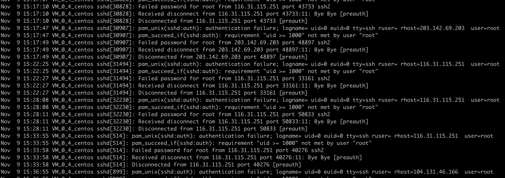

最近双十一买了新购了一台促销服务器，配置环境的时候，在配置`ssh`公钥免密登录的地方小小踩了一下坑...

<!--more-->

1. 在客户端上生成密钥对并复制
   ```shell
   ssh-gen
   cd ~/.ssh 
   cat id_rsa.pub
   ```

2. 服务端配置SSH，打开密钥登录功能
   ```shell
    sudo vim /etc/ssh/sshd_config # 编辑文件
    # add 如下配置
    RSAAuthentication yes
    PubkeyAuthentication yes
    ```

3. 服务器配置登录公钥
   ```shell
   cd ~/.ssh 
   # or 不存在此文件夹
   mkdir ~/.ssh

   vim ~/.ssh/authorized_keys
   # add 前面生成的公钥
   ```

4. 重启服务器SSH服务
   ```shell
   service sshd restart
   ```

完成之后，尝试下发现还是无法登录，检查无果。。没办法，只能查日志



恍然大悟这里还有个小坑，文件夹权限不匹配也是无法登录的~

```
chmod 700 ~/.ssh
chmod 600 ~/.ssh/authorized_keys
chown $(whoami):$(whoami) .ssh
chown $(whoami):$(whoami) ~/.ssh/authorized_keys
```


如果尝试登录还是需要密码，可以通过服务器ssh日志错误一一排查下~

```shell
cd /var/log
sudo tail -f /var/log
```